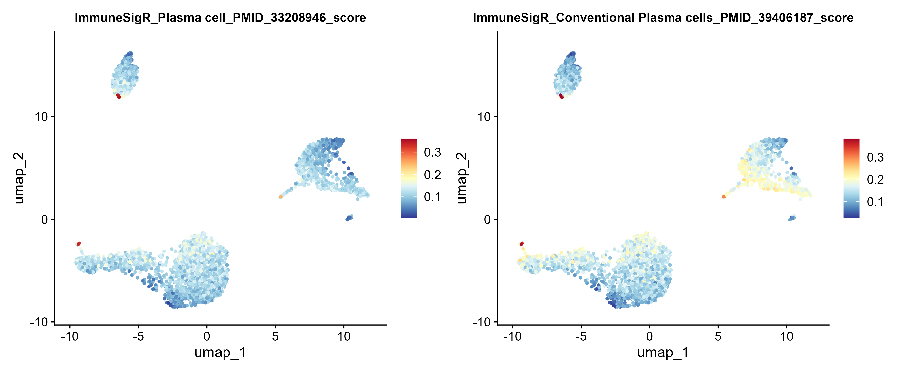

```{r, include = FALSE}
knitr::opts_chunk$set(
  collapse = TRUE,
  comment = "#>"
)
```

Welcome to `ImmuneSigR`. This package provides a rigorous, literature-derived database of immune cell markers formatted as Gene Matrix Transposed (GMT) files, alongside dependency-free rank-based and mean-expression scoring methods for single-cell RNA sequencing (scRNA-seq) data.

## 1. Database Exploration & Search

To ensure rigorous academic provenance, cell subpopulations in `ImmuneSigR` are distinguished by appending their source PubMed IDs (PMIDs) to their names (e.g., `Plasma cell_PMID_33208946`). 

You can easily query the detailed metadata and search for specific cell lineages:

```{r setup}
library(ImmuneSigR)

# Search for B cell related records
b_cell_records <- Search_ImmuneSigR("B cell", search_by = "Cell_Type", fixed = TRUE)
head(b_cell_records[, c("cell_name", "Title", "PMID")])

# Retrieve marker genes (filtering for signatures with at least 5 genes)
t_nk_markers <- Get_Markers(c("T cell", "NK cell"), min_genes = 5)
length(t_nk_markers)
```

## 2. Base R Scoring (Dependency-Free)

`ImmuneSigR` provides robust scoring functions that do not require heavy external dependencies. We can validate this using a simulated matrix:

```{r base-scoring}
# Create a dummy expression matrix for demonstration
demo_genes <- unique(unlist(Get_Markers(c("B cell", "T cell"), min_genes = 5)[1:8]))
demo_genes <- demo_genes[seq_len(min(120, length(demo_genes)))]

set.seed(1)
expr_matrix_dummy <- matrix(
  stats::rpois(length(demo_genes) * 12, lambda = 2),
  nrow = length(demo_genes),
  dimnames = list(demo_genes, paste0("cell_", seq_len(12)))
)

# Calculate Rank Scores (UCell-like)
matrix_rank_scores <- Score_ImmuneSigR(
  expr_matrix_dummy, 
  target_cells = c("B cell", "T cell"), 
  min_genes = 5, 
  method = "rank"
)
head(matrix_rank_scores)
```

## 3. Real Single-Cell Validation (Seurat Integration)

`ImmuneSigR` is designed to integrate seamlessly with real-world scRNA-seq workflows. Below is an example of applying targeted Plasma cell signatures to the PBMC 3k dataset.

*(Note: The following code chunk is not evaluated during CRAN package building to avoid external data downloads, but you can run it locally in your R console).*

```{r seurat, eval = FALSE}
library(Seurat)
library(SeuratData)
library(ggplot2)

# 1. Load and process pbmc3k dataset
data("pbmc3k")
pbmc <- UpdateSeuratObject(pbmc3k)
pbmc <- NormalizeData(pbmc) |> FindVariableFeatures() |> ScaleData() |> RunPCA() |> RunUMAP(dims = 1:10)

# 2. Extract expression matrix and define targets
expr_matrix_real <- as.matrix(pbmc[["RNA"]]$data)
real_targets <- c("Plasma cell_PMID_33208946", "Conventional Plasma cells_PMID_39406187")

# 3. Score using precise targets curated from literature
real_scores <- Score_ImmuneSigR(expr_matrix_real, target_cells = real_targets, min_genes = 5, method = "rank")

# 4. Add to metadata and visualize
pbmc <- AddMetaData(pbmc, metadata = real_scores)
score_cols <- colnames(real_scores)

p_umap <- FeaturePlot(pbmc, features = score_cols[1:2], ncol = 2, pt.size = 0.8) & 
  scale_colour_gradientn(colours = rev(RColorBrewer::brewer.pal(n = 11, name = "RdYlBu")))

# --- Plot Title Optimization (Publication Standard) ---
# Restructure "ImmuneSigR_CellName_PMID_xxxx_score" to "CellName Signature Score\n(PMID: xxxx)"
clean_titles <- gsub("^ImmuneSigR_(.+)_PMID_([0-9]+)_score$", "\\1 Signature Score\n(PMID: \\2)", score_cols[1:2])

p_umap[[1]] <- p_umap[[1]] + ggtitle(clean_titles[1]) + theme(plot.title = element_text(hjust = 0.5, size = 12, face = "bold"))
p_umap[[2]] <- p_umap[[2]] + ggtitle(clean_titles[2]) + theme(plot.title = element_text(hjust = 0.5, size = 12, face = "bold"))

# Display the plot
p_umap
```
<br>

<br>

## 4. GMT File Management

You can effortlessly export the built-in GMT database for external use (e.g., in GSEA) or create your own custom marker sets.

```{r gmt-management}
# We use tempdir() here for CRAN compliance. 
# In practice, you can replace this with your desired output folder (e.g., getwd()).
out_dir <- tempdir()

# Export built-in GMT
exported_gmt <- Export_ImmuneSigR_GMT(out_dir = out_dir)

# Create a custom signature GMT
custom_gmt <- Create_Custom_GMT(
  marker_list = list(
    Custom_T = c("CD3D", "CD3E", "CD8A"),
    Custom_B = c("CD19", "MS4A1", "CD79A")
  ),
  file_name = file.path(out_dir, "custom_demo_signatures.gmt")
)

cat("Exported GMT to:", exported_gmt, "\n")
cat("Created Custom GMT at:", custom_gmt, "\n")
```
