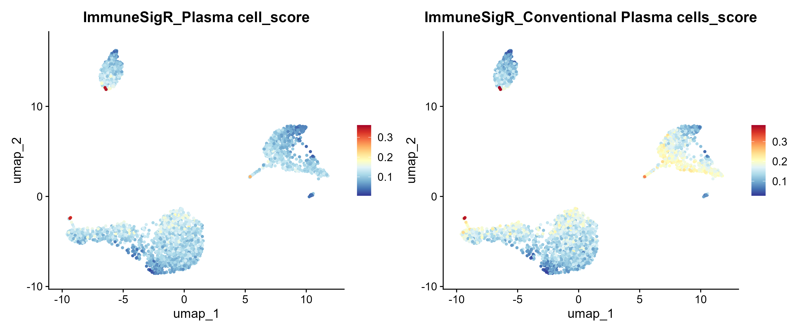

# ImmuneSigR Tutorial

## 1. Introduction

`ImmuneSigR` is a lightweight R package designed for retrieving, exporting, and scoring immune cell marker signatures.

Main features:

- Built-in immune cell marker signature database
- Retrieve signatures by cell type, literature title, PMID, and cell name
- Perform signature scoring on gene-by-cell expression matrices

## 2. Installation

Install from local source code:

```R
#install.packages("remotes")
remotes::install_local("path/to/ImmuneSigR")
```

In development mode, you can directly load the source code:

```R
source("R/ImmuneSigR.R")
```

## 3. Load the Package

```R
library(ImmuneSigR)
```

## 4. View the Database

View all signature metadata:

```R
all_records <- Search_ImmuneSigR()
head(all_records)
```

```R
Found 906 matching cell signatures.
1 A molecular cell atlas of the human lung from single cell RNA sequencing 33208946                 B cell    B cell          162
2 A molecular cell atlas of the human lung from single cell RNA sequencing 33208946            Plasma cell    B cell          200
3 A molecular cell atlas of the human lung from single cell RNA sequencing 33208946 CD8+ Memory/Effector T    T cell          145
4 A molecular cell atlas of the human lung from single cell RNA sequencing 33208946           CD8+ Naive T    T cell          174
5 A molecular cell atlas of the human lung from single cell RNA sequencing 33208946 CD4+ Memory/Effector T    T cell          195
6 A molecular cell atlas of the human lung from single cell RNA sequencing 33208946           CD4+ Naive T    T cell          132
```

The current built-in database contains:

- 906 immune cell signatures
- 10 major `Cell_Type` categories
- Each record includes the source literature, PMID, cell name, and number of markers

Retrieve B cell-related records:

```R
b_cell_records <- Search_ImmuneSigR("B cell", search_by = "Cell_Type")
```

```R
Found 110 matching cell signatures.
```

When searching for keywords containing special regex characters, it is recommended to use `fixed = TRUE`:

```R
cd8_records <- Search_ImmuneSigR("CD8+", search_by = "cell_name", fixed = TRUE)
```

```R
Found 46 matching cell signatures.
```

## 5. Retrieve Marker Signatures

Retrieve all marker signatures:

```R
all_markers <- Get_Markers()
```

Retrieve signatures for specific categories. `min_genes` is used to filter out sets with too few markers. It is recommended to set this to 5 or higher before scoring:

```R
b_markers <- Get_Markers("B cell", min_genes = 5)
t_nk_markers <- Get_Markers(c("T cell", "NK cell"), min_genes = 5)
```

## 6. Export Built-in GMT

Export the built-in GMT database (outputs in standard GMT format):

```R
gmt_path <- Export_ImmuneSigR_GMT(tempdir())
```

## 7. Create Custom GMT

You can create a custom GMT using a named list. The function will automatically trim whitespace, remove duplicates, and skip empty sets:

```R
custom_markers <- list(
  Custom_T = c("CD3D", "CD3E", "CD8A"),
  Custom_B = c("CD19", "MS4A1", "CD79A")
)
custom_gmt <- Create_Custom_GMT(custom_markers, file_name = "custom_signatures.gmt")
```

```R
Custom GMT file created successfully: custom_signatures.gmt
```

## 8. Score Expression Matrices (Basic Independent Test)

`Score_ImmuneSigR()` accepts a gene-by-cell expression matrix (rows are genes, columns are cells), and `rownames` must be gene symbols. The package independently implements two scoring algorithms: `rank` and `mean`:

```R
# Simulate an expression matrix for testing
genes <- unique(unlist(Get_Markers(c("B cell", "T cell"), min_genes = 5)[1:6]))
set.seed(1)
expr <- matrix(
  rpois(length(genes) * 8, lambda = 2),
  nrow = length(genes),
  dimnames = list(genes, paste0("cell_", 1:8))
)

# High-robustness scoring based on rank
scores_rank <- Score_ImmuneSigR(expr, target_cells = "B cell", method = "rank", max_rank = 1500)

# Scoring based on mean expression
scores_mean <- Score_ImmuneSigR(expr, target_cells = "B cell", method = "mean")
```

## 9. Advanced Practical Workflow: Targeted Subpopulation Identification Combined with Seurat

The underlying algorithms of `ImmuneSigR` are independent but can perfectly integrate into the Seurat workflow. In practical research, we strongly recommend following the logic of "Funnel-style retrieval -> Target determination based on literature -> Targeted scoring".

> **💡 Dependency Notes**:
>
> - **Step 9.1 (Knowledge Retrieval)**: Only requires `library(ImmuneSigR)`, no complex environment needed.
> - **Steps 9.2-9.3**
>   - **Seurat**: In this tutorial, it is only used to **provide test data** and **perform standard preprocessing** (e.g., normalization, dimensionality reduction).
>   - **ggplot2**: Only used to **render the scoring results into high-quality scientific charts**.

### 9.1 Funnel-Style Knowledge Retrieval (Example: Searching for Plasma Cells)

Directly scoring broad categories (like B cells) can easily cause information redundancy. You should first use the retrieval function to pinpoint target literature sources. We follow the approach of "Overview major categories -> Pinpoint lineage -> Precise subdivision".

```R
library(ImmuneSigR)

# 1. Overview all major cell categories (Cell_Type) supported by the database
all_records <- Search_ImmuneSigR()
print(unique(all_records$Cell_Type))

# 2. Pinpoint the B cell lineage within the major categories
b_results <- Search_ImmuneSigR("B cell", search_by = "Cell_Type")

# 3. Within B cells, precisely filter subpopulations containing the keyword 'Plasma'
plasma_hits <- b_results[grepl("Plasma", b_results$cell_name, ignore.case = TRUE), ]

# 4. Print results, select the most suitable markers via the description (the second column of GMT, containing the literature source)
print(head(plasma_hits[, c("cell_name", "Title", "PMID")]))
```

```R
> all_records <- Search_ImmuneSigR()
Found 906 matching cell signatures.
> print(unique(all_records$Cell_Type))
 [1] "B cell"         "T cell"         "NK cell"        "Mast cell"     
 [5] "Macrophage"     "Dendritic cell" "Monocyte"       "Neutrophil"    
 [9] "Basophil"       "Eosinophil"    
> b_results <- Search_ImmuneSigR("B cell", search_by = "Cell_Type")
Found 110 matching cell signatures.
> plasma_hits <- b_results[grepl("Plasma", b_results$cell_name, ignore.case = TRUE), ]
> print(head(plasma_hits[, c("cell_name", "Title", "PMID")]))
                       cell_name
2                    Plasma cell
25                        Plasma
45     Conventional Plasma cells
47         Stressed Plasma cells
49 IGKC-high Plasma/Plasmablasts
51 MT1X-high Plasma/Plasmablasts
                                                                      Title     PMID
2  A molecular cell atlas of the human lung from single cell RNA sequencing 33208946
25 A molecular cell atlas of the human lung from single cell RNA sequencing 33208946
45           A pan-cancer single-cell RNA-seq atlas of intratumoral B cells 39406187
47           A pan-cancer single-cell RNA-seq atlas of intratumoral B cells 39406187
49           A pan-cancer single-cell RNA-seq atlas of intratumoral B cells 39406187
51           A pan-cancer single-cell RNA-seq atlas of intratumoral B cells 39406187
```

Based on the literature sources above, we select `"Plasma cell"` and `"Conventional Plasma cells"` as the scoring targets.

### 9.2 Prepare Validation Environment and Targeted Scoring

Extract the pure expression matrix from a Seurat object (e.g., `pbmc3k`) and pass it to the package for processing:

```R
library(Seurat)
library(SeuratData)
library(ggplot2)

# Load and preprocess pbmc3k data (only used for extracting the expression matrix and subsequent visualization)
data("pbmc3k")
pbmc <- UpdateSeuratObject(pbmc3k)
pbmc <- NormalizeData(pbmc, verbose = FALSE)
pbmc <- FindVariableFeatures(pbmc, verbose = FALSE)
pbmc <- ScaleData(pbmc, verbose = FALSE)
pbmc <- RunPCA(pbmc, verbose = FALSE)
pbmc <- RunUMAP(pbmc, dims = 1:10, verbose = FALSE)
# Extract the matrix (perform independent calculation outside the Seurat framework)
expr_matrix <- as.matrix(pbmc[["RNA"]]$data)

# Targeted scoring
my_targets <- c("Plasma cell", "Conventional Plasma cells")
scores <- Score_ImmuneSigR(expr_matrix, target_cells = my_targets, method = "rank")
```

### 9.3 Result Mapping and Visualization

Map the scoring results back to the Seurat metadata and plot:

```R
pbmc <- AddMetaData(pbmc, metadata = scores)
score_cols <- colnames(scores)
if(length(score_cols) >= 2) {
  p_umap <- FeaturePlot(pbmc, features = score_cols[1:2], ncol = 2, pt.size = 0.8) & 
    scale_colour_gradientn(colours = rev(RColorBrewer::brewer.pal(n = 11, name = "RdYlBu")))}
# Plotting
pdf_path <- file.path(out_dir, "ImmuneSigR_Validation_UMAP.pdf")
ggsave(filename = pdf_path, plot = p_umap, width = 12, height = 5, device = "pdf")
png_path <- file.path(out_dir, "ImmuneSigR_Validation_UMAP.png")
ggsave(filename = png_path, plot = p_umap, width = 12, height = 5, dpi = 300)
```

**Empirical Performance:** For plasma cells, which have an extremely low abundance in normal human peripheral blood, `ImmuneSigR` achieved capture with an extremely high signal-to-noise ratio, approaching zero background noise, and signatures from different literature sources achieved perfect cross-validation.



## 10. Output Explanation

`Score_ImmuneSigR()` outputs a data.frame:

- **Rows**: Cells or samples
- **Columns**: Signature scores
- **Column name format**: `ImmuneSigR_<signature_name>_score`

**rank score (Recommended):**

- Ranges from approximately 0 to 1
- The closer to 1, the higher the marker genes rank in that cell. This method greatly reduces batch effect interference caused by sequencing depth and extreme expression values.

**mean score:**

- Represents the mean expression of the marker genes.
- The numerical scale depends on the input expression matrix and is easily affected by normalization methods.

## 11. Recommended Workflow and Suggestions

1. Use gene symbols as rownames for the input matrix.
2. Set `min_genes = 5` or higher before scoring.
3. Use `fixed = TRUE` for keywords containing characters like `+`, `(`, `)`.
4. Use `rank score` for primary analysis and `mean score` for secondary checking.

## 12. Reproducible Demo and Unit Tests

This repository contains a complete local demo integrating basic functional tests and single-cell visualization practice, which you can run directly in the package root directory:

```R
source("analysis/run_cellsigr_demo.R")
```

**Output Directory**: `analysis/outputs/`

After running this script, the main output files meeting validation requirements will be generated:

- `immunesigr_demo_summary.csv` (Full database overview)
- `cell_type_counts.csv`
- `b_cell_search_results.csv`
- `cd8_search_results.csv`
- `matrix_rank_scores.csv`
- `matrix_mean_scores.csv`
- `ImmuneSigR_signatures.gmt` (Built-in database export)
- `custom_demo_signatures.gmt`
- `ImmuneSigR_Validation_UMAP.pdf` (Research publication-grade vector image)
- `ImmuneSigR_Validation_UMAP.png` (High-definition PNG image)
